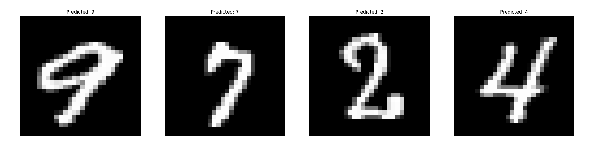

# Convolutional Neural Network Implementation in Verilog

## Overview

This project involves the implementation of a Convolutional Neural Network (CNN) using Verilog. The design includes several key components:

- **Control Unit**: Manages the state of the system.
- **2D Convolution**: Applies convolutional filters to the input data.
- **2D Max Pooling**: Reduces the dimensionality of the data while retaining important features.
- **ReLU Activation**: Introduces non-linearity into the model.
- **Dense Layer**: Connects the features extracted by previous layers to the output.

## Convolutional Layer Details

In the convolutional layer, filters are progressively refined to capture increasingly specific and detailed features from the data. This hierarchical approach allows the model to learn complex patterns effectively.

## Training and Deployment

The model was trained using PyTorch. The trained weights were then exported to `.hex` files and imported into this hardware execution.

## Simulation

The design was simulated using GTKWave, a waveform viewer for visualizing the behavior of digital circuits.

